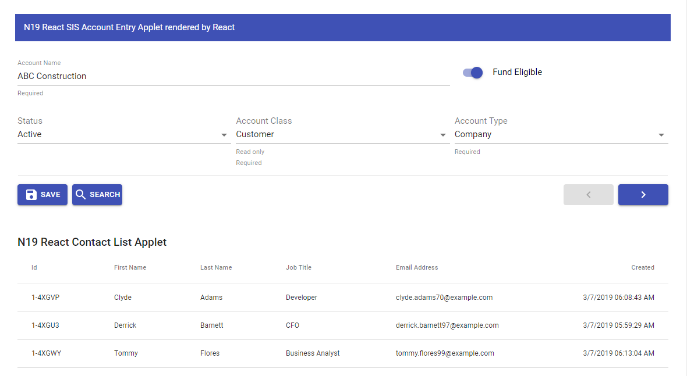

# Quick Start Guide: Nexus Bridge + React example

This guide will help to setup Nexus Bridge with the demo that is built using Nexus Bridge and React framework.
 The demo supports:
- navigation through records
- displaying, editing or deleting records (supporting keyboard shortcuts)
- query (supporting keyboard shortcuts)
- picklists that are read from Siebel configuration
- field properties that are read from Siebel configuration (required, field length)

Requirements: this example requires access to icons and fonts stored on https://fonts.googleapis.com/

This is not an example of implementation that can be used on production. It is intentionally kept straightforward.
The demo example was tested on Seibel 16.19 and 18.08 ENU.

 

1. Make a clean [Nexus Bridge Setup](/../wikis/Setup Nexus Bridge) if you haven't done it before.
1. Import the `n19helper-master/examples/REACT Examples/Demo Example/SIF/*` into the Siebel Tools.
1. Add the `N19 React Account Screen` to your application:
      * Findout your Siebel Application Name in application `.cfg` file or by logging in and typing `SiebelApp.S_App.GetAppName()` into Chrome Developer Tools console.
      * Use Siebel Tools and add `N19 React Account Screen` under `Application > Screen Menu Item` for your Siebel Application Name
      * Also add `N19 React Account Screen`(with `N19 React` value for `Text - String Override` property) under `Application > Page Tab` for your Siebel Application Name
1. Compile(Siebel IP16 and earlier) or Deliver(Siebel IP17+) following objects: 
    * `Nexus19 React Demo Examples` project
    * Application object, that you've updated above.
1. Add the `N19 React Account View` to your application:
      * Use Siebel Client to add a new record with Name `N19 React Account View` under `Administration - Application > Views`
      * Under `Administration - Application > Views` add any Responsibility to this View
      * Under `Administration - User > Users` – add same Responsibility to your User
      * Click `Clear cache` button under `Administration – Application > Responsibilities` view
1. Re-login to your Siebel Application and check that the `N19 React Account Screen` Screen is available.
1. Copy the file below to the `[Siebel Client or Server Home]\public\SCRIPTS\siebel\custom` folder:
    * `n19helper-master/packages/nexus-bridge/SIEBEL/PUBLIC/NBAppletPR.js`.
1. Copy below files and folders to the `[Siebel Client or Server Home]\public\SCRIPTS\siebel\custom\react-app` folder:
    * `n19helper-master/examples/REACT Examples/Demo Example/react-app/build/*`.
1. Use Siebel Client to reference js files in Siebel Open UI Manifest as follows:
	- under `Administration - Application > Manifest Files` 
	>- add a new record with: 
	> **Name:** `siebel/custom/react-app/N19_REACT_PR.js`
	> **Name:** `siebel/custom/NBAppletPR.js`

	- under `Administration - Application > Manifest Administration` 

   >- add a new record under **UI Objects** with: 
   >     **Name:** `N19 React SIS Account Entry Applet`
   >     **Usage Type:** `Physical Renderer`
   >     **Type:** `Applet`

   >- add a new record under **Object Expression** with:
   >     **Level:** `1`

   >- add a new record under **Files** with:
   > **Name:** `siebel/custom/react-app/N19_REACT_PR.js`

	- under `Administration - Application > Manifest Administration` 

   >- add a new record under **UI Objects** with: 
   >     **Name:** `N19 React Contact List Applet`
   >     **Usage Type:** `Physical Renderer`
   >     **Type:** `Applet`

   >- add a new record under **Object Expression** with:
   >     **Level:** `1`

   >- add a new record under **Files** with:
   > **Name:** `siebel/custom/NBAppletPR.js`

1. Empty browser cache and hard reload
    *(e.g. using Chrome: press F12, then right-click a browser Refresh button and press ‘Empty Cache and Hard Reload’)*
1. Re-login to your Siebel Application.
1. Navigate to the `N19 React` Screen.
